# International Cybersecurity and Digital Forensics Academy (ICDFA)

# SBT-DF203: Basic Networking Skills for Digital Forensics

# LAB 5: ARP Poisoning Forensics

| Course Code | SBT-DF203 |
| --- | --- |
| Registration Number | FWSD25/11242 |
| Course Title | Basic Networking Skills for Digital Forensics |
| Lab Number | Lab 5 |
| Lab Title | ARP Poisoning Forensics |
| Required Evidence | arp.pcap and an isolated host-only ARP capture |

## Learning Outcomes

Explain how ARP maps IPv4 addresses to MAC addresses on a LAN.

Inspect ARP caches on Linux and Windows systems.

Identify ARP requests, legitimate replies and unsolicited or conflicting replies.

Detect one IP address being associated with multiple MAC addresses.

Capture and document a bounded ARP-poisoning simulation in a host-only network.

Restore network state and recommend preventive controls.

## Executive Summary

This lab investigated ARP traffic to understand normal ARP resolution and identify indicators of ARP poisoning. The analysis used Linux networking commands and TShark to record interface information, routing information, ARP-cache entries, and packet-level ARP fields. A normal ARP exchange was captured between 192.168.37.221 and the gateway 192.168.37.2, showing a broadcast ARP request followed by a unicast reply. The supplied arp.pcap was then examined for ARP replies and IP-to-MAC claims. Two unicast ARP replies were observed: 136.160.215.194 was associated with 00:50:56:86:02:65, while 136.160.215.15 was associated with 00:50:56:86:cb:fc. The supplied evidence did not show one IP address being claimed by multiple MAC addresses. A controlled host-only capture was also prepared, and the ARP table was checked before restoration. The lab demonstrates how ARP packet fields and ARP-cache changes can be used as forensic evidence while recognizing that conclusions are limited to the packets present in the supplied capture.

## Lab Folder Structure and Evidence Preparation

```bash
mkdir -p ~/SBT-DF203-Lab5/{evidence,working,exported,reports,screenshots,scripts}
```

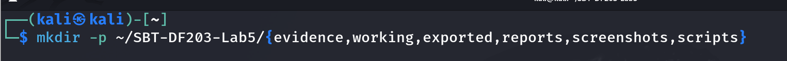

```bash
cd ~/SBT-DF203-Lab5
```

```bash
pwd
```


```bash
find . -maxdepth 1 -type d -print
```


Create the folder structure before downloading or generating evidence. Store original captures under evidence and analysis copies under working.


```bash
sudo apt update
sudo apt install -y wireshark tshark python3-scapy net-tools
```

```bash
wget -O evidence/arp.pcap \
  'https://raw.githubusercontent.com/frankwxu/digital-forensics-lab/main/Networking_Forensics/lab_files/ARP_spoofing/arp.pcap'
```

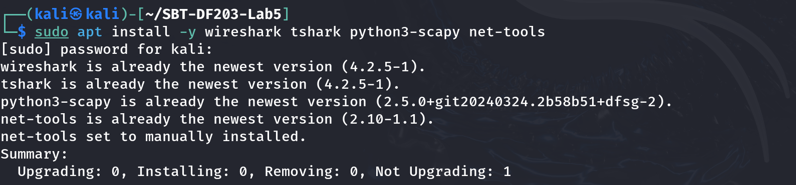

```bash
cp --preserve=timestamps evidence/arp.pcap working/arp_working.pcap
```

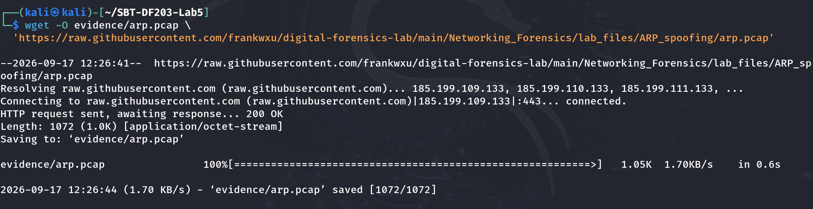

```bash
sha256sum evidence/arp.pcap working/arp_working.pcap | tee reports/arp_capture_hashes.txt
```


```bash
ip -br address | tee reports/interfaces.txt
```

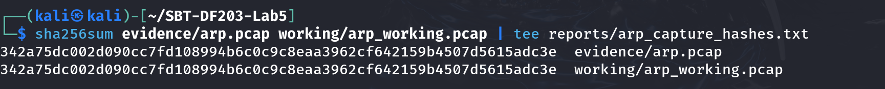

```bash
ip route | tee reports/routes.txt
```

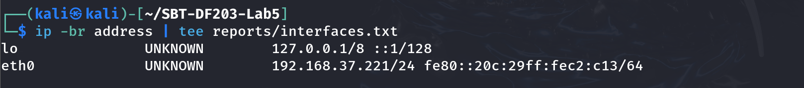

```bash
ip neigh show | tee reports/arp_table_initial.txt
```

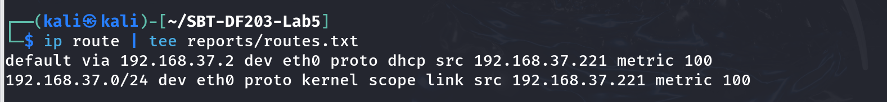

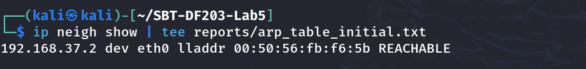

## Mini Evidence and Chain-of-Custody Worksheet

| Field | Student Entry |
| --- | --- |
| Case/lab identifier | SBT-DF203-Lab5-YourFullName |
| Trainee name | Basiru Aliyu |
| Date and time started | 17/09/2026 |
| Evidence file name(s) | arp.pcap |
| Source or generation method | Downloaded from github |
| Original SHA-256 | 342a75dc002d090cc7fd108994b6c0c9c8eaa3962cf642159b4507d5615adc3e |
| Working-copy SHA-256 | 342a75dc002d090cc7fd108994b6c0c9c8eaa3962cf642159b4507d5615adc3e |
| Analysis workstation/VM | Vm ware workstation |
| Notes on any changes | No changes were made. |

Part A - Observe Normal ARP Resolution

Identify the victim IP, gateway IP and your interface name.

Clear only the specific training neighbor entry where permitted.

Start an ARP-only capture, ping the gateway once and stop the capture.

Identify the broadcast request and unicast reply.

```bash
IFACE=eth0
```

```bash
GATEWAY_IP=$(ip route | awk '/default/ {print $3; exit}')
```


```bash
sudo ip neigh flush "$GATEWAY_IP" dev "$IFACE"
```


```bash
sudo tshark -i "$IFACE" -f 'arp' -a duration:20 -w evidence/normal_arp.pcapng &
sleep 2
```


```bash
ping -c 1 "$GATEWAY_IP"
```

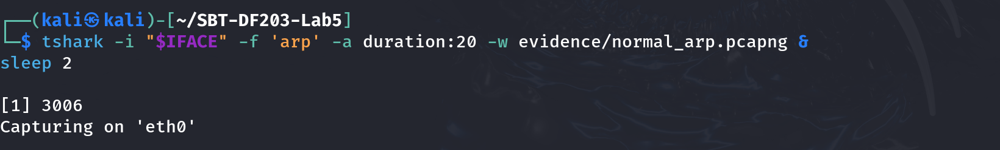

wait
Command used: ip neigh show | tee reports/arp_table_after_ping.txt

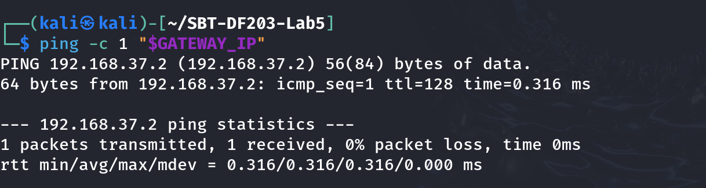

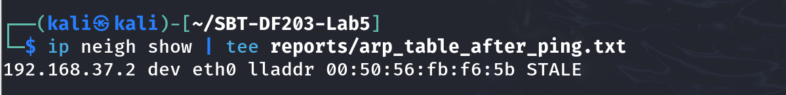

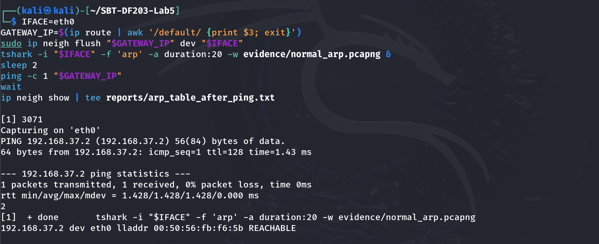

Part B - Analyze ARP Request and Reply Fields

```bash
tshark -r evidence/normal_arp.pcapng -Y 'arp' -T fields \
  -e frame.number -e frame.time -e eth.src -e eth.dst -e arp.opcode \
  -e arp.src.proto_ipv4 -e arp.src.hw_mac -e arp.dst.proto_ipv4 -e arp.dst.hw_mac \
  | tee reports/normal_arp_fields.tsv
```

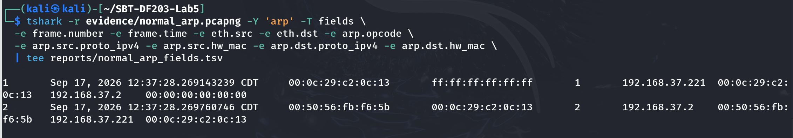

| Field | Normal Request | Normal Reply |
| --- | --- | --- |
| Ethernet destination | ff:ff:ff:ff:ff:ff | Requester MAC |
| ARP opcode | 1 | 2 |
| Sender protocol address | Requester IP | 192.168.37.221 |
| Sender hardware address | Requester MAC | 00:0c:29:c2:0c:13 |
| Target protocol address | Target IP | 192.168.37.221 |
| Forensic interpretation | Who has target IP? | Target IP is at target MAC. |

10. Part C - Analyze the Supplied Poisoning Capture

PCAP=working/arp_working.pcap

Inventory all ARP claims
Command used: tshark -r "$PCAP" -Y 'arp.opcode==2' -T fields \
  -e frame.number -e frame.time_epoch -e eth.src -e eth.dst \
  -e arp.src.proto_ipv4 -e arp.src.hw_mac -e arp.dst.proto_ipv4 -e arp.dst.hw_mac \
  | tee reports/arp_replies.tsv

Summarize IP-to-MAC claims
Command used: tshark -r "$PCAP" -Y 'arp.opcode==2' -T fields -e arp.src.proto_ipv4 -e arp.src.hw_mac \
  | sort | uniq -c | sort -nr | tee reports/ip_mac_claims.txt

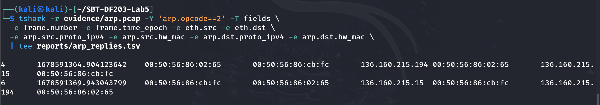

Look for gratuitous or unsolicited-looking replies
Command used: tshark -r "$PCAP" -Y 'arp.opcode==2 && eth.dst!=ff:ff:ff:ff:ff:ff' -T fields \
  -e frame.number -e frame.time -e arp.src.proto_ipv4 -e arp.src.hw_mac -e eth.dst \
  | tee reports/unicast_arp_replies.tsv

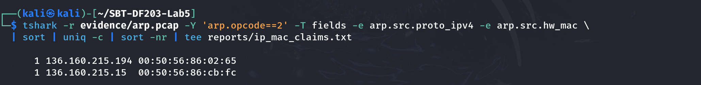

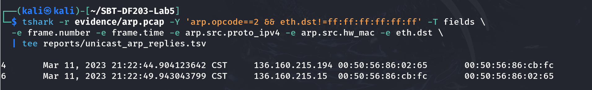

Part D - Optional Controlled Host-Only Simulation

Record clean ARP tables on victim and gateway.

Start ARP capture on the analyst VM.

Run the instructor-provided arp.py for no more than 30 seconds.

Capture the changed victim mapping and stop the script.

Restore correct ARP mappings or restart the isolated VMs.

Example placeholders only - replace with instructor-assigned lab IPs
VICTIM_IP=192.168.37.221
GATEWAY_IP=192.168.37.2
IFACE=eth0

sudo tshark -i "$IFACE" -f 'arp' -a duration:40 -w evidence/controlled_arp_poison.pcapng &
sleep 2
# In another terminal, run the instructor-provided script for <=30 seconds:
# sudo timeout 30 python3 scripts/arp.py "$192.168.37.221" "$192.168.37.2"
wait

Command used: ip neigh show | tee reports/analyst_arp_table_after.txt

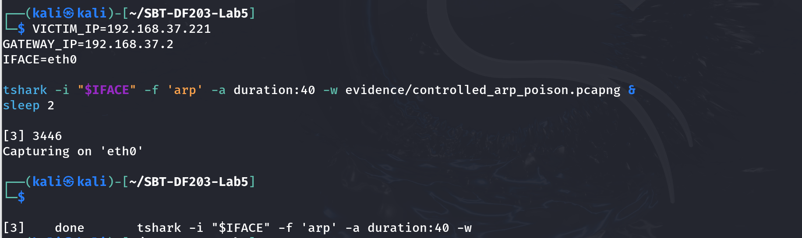

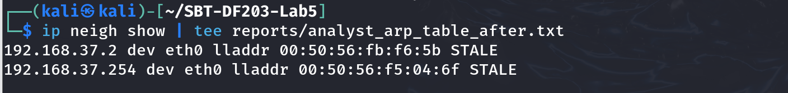

Part E - Detection Logic and Timeline

| Time | Claimed IP | Claimed MAC | Target | Request Seen First? | Assessment |
| --- | --- | --- | --- | --- | --- |
|  |  |  |  |  |  |
|  |  |  |  |  |  |
|  |  |  |  |  |  |
|  |  |  |  |  |  |

Flag a gateway IP that changes from its legitimate MAC to the analyst/attacker MAC.

Flag repeated ARP replies without a corresponding recent request.

Flag one MAC claiming both victim and gateway IP addresses.

Correlate ARP evidence with packet forwarding, DNS/HTTP anomalies and endpoint ARP-cache changes.

## Restoration and Prevention

Stop any training script first, then clear learned entries on the lab VM
Command used: sudo ip neigh flush all

Renew/reconnect the isolated interface as appropriate
Command used: ip neigh show
 Confirm no ARP-poisoning process remains
Command used: ps aux | grep -E '[a]rp.py|[s]capy' | tee reports/process_check.txt


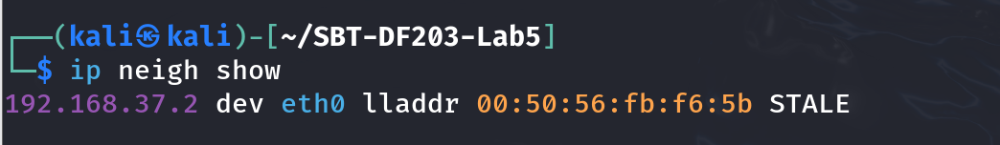


| Command | Short explanation |
| --- | --- |
| mkdir -p ~/SBT-DF203-Lab5/{evidence,working,exported,reports,screenshots,scripts} | Creates the Lab 5 folder structure for evidence, working files, reports, screenshots and scripts. |
| cd ~/SBT-DF203-Lab5 | Moves into the Lab 5 working directory. |
| pwd | Displays the current working directory to confirm the location. |
| find . -maxdepth 1 -type d -print | Lists the Lab 5 subdirectories to verify the folder structure. |
| sudo apt update | Refreshes the package lists before installation. |
| sudo apt install -y wireshark tshark python3-scapy net-tools | Installs Wireshark/TShark, Scapy and networking utilities required for the lab. |
| wget -O evidence/arp.pcap '<GitHub URL>' | Downloads the supplied ARP capture and saves it as arp.pcap in the evidence folder. |
| cp --preserve=timestamps evidence/arp.pcap working/arp_working.pcap | Creates a working analysis copy while preserving the original timestamps. |
| sha256sum evidence/arp.pcap working/arp_working.pcap \| tee reports/arp_capture_hashes.txt | Calculates SHA-256 hashes and saves them as evidence-integrity records. |
| ip -br address \| tee reports/interfaces.txt | Shows network interfaces and IP addresses and records the output. |
| ip route \| tee reports/routes.txt | Displays the routing table, including the default gateway, and saves it. |
| ip neigh show \| tee reports/arp_table_initial.txt | Displays the initial ARP/neighbour cache and saves it. |
| sudo ip neigh flush "$GATEWAY_IP" dev "$IFACE" | Removes the selected gateway ARP/neighbour entry so fresh resolution can be observed. |
| sudo tshark -i "$IFACE" -f 'arp' -a duration:20 -w evidence/normal_arp.pcapng & | Captures ARP packets for 20 seconds on the selected interface and saves them. |
| sleep 2 | Waits two seconds to allow the packet capture to start. |
| ping -c 1 "$GATEWAY_IP" | Sends one ping to the gateway, triggering ARP resolution if needed. |
| wait | Waits for the background TShark capture to finish. |
| ip neigh show \| tee reports/arp_table_after_ping.txt | Displays and records the ARP/neighbour cache after the ping. |
| tshark -r evidence/normal_arp.pcapng -Y 'arp' -T fields ... \| tee reports/normal_arp_fields.tsv | Reads the normal capture, filters ARP packets, extracts selected fields and saves the results. |
| tshark -r "$PCAP" -Y 'arp.opcode==2' -T fields ... \| tee reports/arp_replies.tsv | Extracts ARP reply packets and records their frame, time, Ethernet and ARP fields. |
| tshark -r "$PCAP" -Y 'arp.opcode==2' -T fields -e arp.src.proto_ipv4 -e arp.src.hw_mac \| sort \| uniq -c \| sort -nr \| tee reports/ip_mac_claims.txt | Counts and sorts IP-to-MAC claims to help identify conflicting mappings. |
| tshark -r "$PCAP" -Y 'arp.opcode==2 && eth.dst!=ff:ff:ff:ff:ff:ff' -T fields ... \| tee reports/unicast_arp_replies.tsv | Extracts ARP replies sent to unicast Ethernet destinations for further forensic review. |
| sudo tshark -i "$IFACE" -f 'arp' -a duration:40 -w evidence/controlled_arp_poison.pcapng & | Starts a bounded ARP-only capture for the optional host-only simulation. |
| sudo timeout 30 python3 scripts/arp.py ... | Runs the instructor-provided ARP simulation for a maximum of 30 seconds on the isolated lab network. |
| ip neigh show \| tee reports/analyst_arp_table_after.txt | Records the analyst VM's ARP/neighbour cache after the controlled test. |
| sudo ip neigh flush all | Clears learned neighbour entries during restoration. |
| ps aux \| grep -E '[a]rp.py\|[s]capy' \| tee reports/process_check.txt | Checks for remaining ARP simulation/Scapy processes and records the result. |

## Conclusion

The ARP poisoning forensics lab demonstrated how normal ARP resolution can be established and compared with captured ARP activity to identify potentially suspicious mappings. The normal capture showed the expected broadcast request and unicast reply for the gateway 192.168.37.2. Analysis of the supplied arp.pcap identified two unicast ARP replies and two IP-to-MAC associations, with no duplicate MAC claim for the same IP in the evidence examined. Therefore, the supplied packet evidence does not by itself demonstrate an IP address changing between multiple MAC addresses. The lab also showed the importance of recording interface, route and ARP-cache information, preserving evidence hashes, and checking the ARP table after a controlled test. Any forensic assessment remains limited to the traffic captured and the evidence available in the lab.
